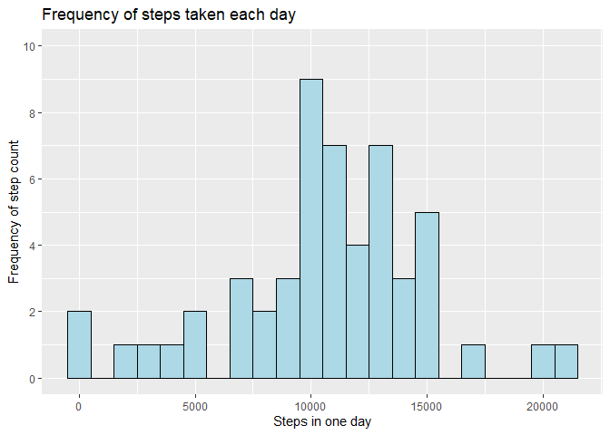
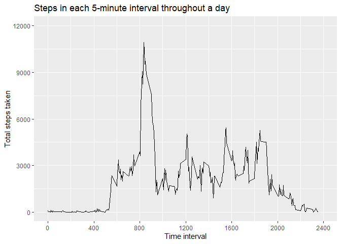
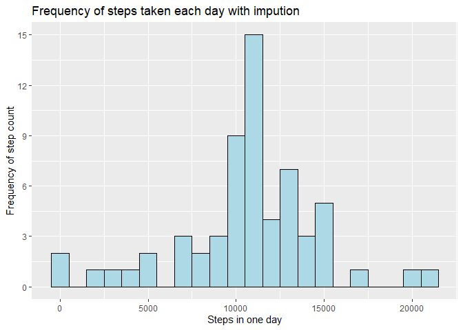
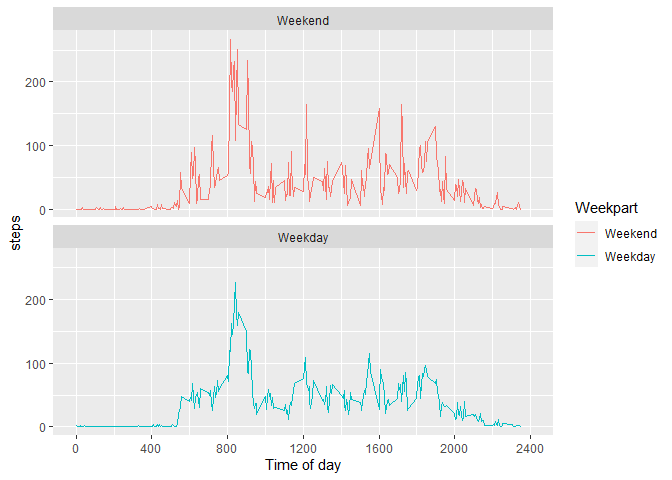

## Loading and preprocessing the data
The data can be loaded into a variable by first unzipping the file (which I 
have moved to the folder Data/) using unzip() and then read.csv() on the output.

```r
activity <- read.csv(unzip("Data/activity.zip"))
head(activity)
```

```
##   steps       date interval
## 1    NA 2012-10-01        0
## 2    NA 2012-10-01        5
## 3    NA 2012-10-01       10
## 4    NA 2012-10-01       15
## 5    NA 2012-10-01       20
## 6    NA 2012-10-01       25
```


## What is mean total number of steps taken per day?
So obviously there will be a couple of steps to this process. Firstly, we need 
to collect all of the data for each individual day into a single measurement
for each day. Note that the 8 days containing NAs only are excluded.

```r
daily_steps <- aggregate(activity$steps, by=list(Category=activity$date), FUN=sum)
head(daily_steps)
```

```
##     Category     x
## 1 2012-10-01    NA
## 2 2012-10-02   126
## 3 2012-10-03 11352
## 4 2012-10-04 12116
## 5 2012-10-05 13294
## 6 2012-10-06 15420
```
By doing this, we'll have a set of data which is able to be graphed as a histogram
and then worked against to find the daily mean and median.

Below now is the code which graphs the histogram of the frequency of step counts
for each day.

```r
daily_steps <- data.frame(
   date = daily_steps$Category,
   steps = daily_steps$x
   )

library(ggplot2)

daily_total <- ggplot(daily_steps, aes(x=steps)) + 
  geom_histogram(binwidth = 1000, color = "black", fill = "light blue") + 
  ggtitle("Frequency of steps taken each day") + 
  scale_y_continuous(name="Frequency of step count", limits=c(0, 10), breaks = c(0, 2, 4, 6, 8, 10)) + 
  xlab("Steps in one day")
daily_total
```

<!-- -->

That's a nice looking figure and all, but what's the actual answer here?
The aggregated daily_steps dataframe has the daily sum of all steps taken. We can
use this to easily find the mean and median. Per the instructions of the problem,
NAs will be removed.

```r
median_steps <- median(daily_steps$steps, na.rm = TRUE)
mean_steps <- mean(daily_steps$steps, na.rm = TRUE)
mean_rounded <- as.character(round(mean_steps, 2))
```
The result of this shows that the mean for the data is 10766.19 while the median is 10765

## What is the average daily activity pattern?
To answer this question, let's first aggregate the data by the interval instead
of the date. Note that here we must remove all NAs from the data or we are left 
with a bunch of nonsense.

```r
interval_steps <- aggregate(activity$steps, by=list(Category=activity$interval), FUN=sum, na.action = NULL, na.rm = TRUE)
names(interval_steps) <- c("interval", "steps")
head(interval_steps)
```

```
##   interval steps
## 1        0    91
## 2        5    18
## 3       10     7
## 4       15     8
## 5       20     4
## 6       25   111
```

Making the time series plot for this, we get the average values over the course of each day

```r
daily_ts <- ggplot(interval_steps, aes(x=interval, y=steps)) + geom_line() + 
  ggtitle("Steps in each 5-minute interval throughout a day") + 
  scale_x_continuous(name="Time interval", limits=c(0, 2400), breaks = c(0, 400, 800, 1200, 1600, 2000, 2400)) +
  scale_y_continuous(name="Total steps taken", limits=c(0, 12000), breaks = c(0, 3000, 6000, 9000, 12000))
daily_ts
```

<!-- -->

From this, we can see a spike at roughly 8:30 AM. To find the exact value and time, 
we should try looking in the interval_steps dataframe for the maximum steps value.

```r
max_row <- interval_steps[interval_steps$steps == max(interval_steps$steps),]
```
From this, we can see that the maximum step count is exactly 10927, 
occurring at interval value 835, or 8:35-8:40AM.

## Imputing missing values
There isn't really a great answer for how to do this, frankly. I'd like to discuss
some options, first. Consider the following:

1. Set all NA values to 0.
This option doesn't really do anything productive, but maybe it'll make all of 
the data usable if na.rm is not getting the job done for some reason.
2. Set all NA values to the mean/median on that day. 
The issue with this comes from whenever you would make considerations based on 
the interval across all days. If the average for one day is, say, 300 steps, then 
suddenly every single different interval increases by 300, effectively changing 
"0" value of that data.
3. Set all NA values to the mean/median of that interval.
This one is much more viable for having the data be based on what might be expected 
for that interval. In this case, the 8 days with NA values are isolated, and so 
whenever you plot this data there would be a clear spike at the mean or median
created by these 8 days.

Ultimately, I believe option 3 is most applicable here.
Let's start by finding the mean and median of each interval.

```r
interval_means <- aggregate(activity$steps, by=list(Category=activity$interval), FUN=mean, na.action = NULL, na.rm = TRUE)
interval_medians <- aggregate(activity$steps, by=list(Category=activity$interval), FUN=median, na.action = NULL, na.rm = TRUE)

interval_details <- cbind(interval_means, interval_medians[,2])
names(interval_details) <- c("interval", "mean", "median")

head(interval_details)
```

```
##   interval      mean median
## 1        0 1.7169811      0
## 2        5 0.3396226      0
## 3       10 0.1320755      0
## 4       15 0.1509434      0
## 5       20 0.0754717      0
## 6       25 2.0943396      0
```

Something you start to see here is that actually, on most intervals, the step 
count has a median of 0! It's extremely skewed, so the mean is the only usable 
summary statistic here.

So now we need to look at the original data and take every row with a NA value 
and replace those with the value stored in the interval_means dataframe.

```r
activity_original <- activity

for(row in 1:dim(activity)[1]) {
  if(is.na(activity[row,"steps"])){
    current_interval <- activity[row,"interval"]
    current_mean <- interval_means[interval_details$interval == current_interval,][2]
    activity[row,"steps"] <- round(current_mean)
  }
}
head(activity)
```

```
##   steps       date interval
## 1     2 2012-10-01        0
## 2     0 2012-10-01        5
## 3     0 2012-10-01       10
## 4     0 2012-10-01       15
## 5     0 2012-10-01       20
## 6     2 2012-10-01       25
```

The replacement succeeded, and all values of step that were NA are now assigned 
to that interval's mean value, instead. Now, lastly, let's look at the mean and 
median once again. And compare the two.


```r
daily_mean_original <- aggregate(activity_original$steps, by=list(Category=activity_original$date), FUN=mean, na.action = NULL, na.rm = TRUE)
daily_median_original <- aggregate(activity_original$steps, by=list(Category=activity_original$date), FUN=median, na.action = NULL, na.rm = TRUE)
daily_mean <- aggregate(activity$steps, by=list(Category=activity$date), FUN=mean, na.action = NULL, na.rm = TRUE)
daily_median <- aggregate(activity$steps, by=list(Category=activity$date), FUN=median, na.action = NULL, na.rm = TRUE)

changed_means <- daily_mean$x != daily_mean_original$x
changed_means[is.na(changed_means)] <- TRUE

changed_medians <- daily_median$x != daily_median_original$x
changed_medians[is.na(changed_medians)] <- TRUE

new_old_means <- cbind(daily_mean, daily_mean_original[,2])[changed_means,]
new_old_medians <- cbind(daily_median, daily_median_original[,2])[changed_medians,]

names(new_old_means) <- c("date", "new mean", "old mean")
names(new_old_medians) <- c("date", "new median", "old median")

new_old_means
```

```
##          date new mean old mean
## 1  2012-10-01 37.36806      NaN
## 8  2012-10-08 37.36806      NaN
## 32 2012-11-01 37.36806      NaN
## 35 2012-11-04 37.36806      NaN
## 40 2012-11-09 37.36806      NaN
## 41 2012-11-10 37.36806      NaN
## 45 2012-11-14 37.36806      NaN
## 61 2012-11-30 37.36806      NaN
```

```r
new_old_medians
```

```
##          date new median old median
## 1  2012-10-01       34.5         NA
## 8  2012-10-08       34.5         NA
## 32 2012-11-01       34.5         NA
## 35 2012-11-04       34.5         NA
## 40 2012-11-09       34.5         NA
## 41 2012-11-10       34.5         NA
## 45 2012-11-14       34.5         NA
## 61 2012-11-30       34.5         NA
```

From the above, we see that only 8 days of data actually had their mean and median 
at all. These 8 days are the original dates where the steps data was given as NA. 
Thus, this has had no effect on these summary statistics for the other 53 days.

Moving on, we can show both the old total steps plot and the new one.

```r
daily_steps <- aggregate(activity$steps, by=list(Category=activity$date), FUN=sum)

daily_steps <- data.frame(
   date = daily_steps$Category,
   steps = daily_steps$x
   )

updated_totals <- ggplot(daily_steps, aes(x=steps)) + 
  geom_histogram(binwidth = 1000, color = "black", fill = "light blue") + 
  ggtitle("Frequency of steps taken each day with impution") + 
  scale_y_continuous(name="Frequency of step count", limits=c(0, 15), breaks = c(0, 3, 6, 9, 12, 15)) + 
  xlab("Steps in one day")

daily_total
```

<!-- -->

```r
updated_totals
```

<!-- -->

As you can see, the only difference between these two datasets' plots is that the
modified dataset contains an additional8 values at the mean of all of the data 
since that was the summary statistic selected to perform the impution through. The 
ultimate decision on whether or not to use these 8 modified days of data would 
then need to be made by taking considerations on the question asked and the 
overall purpose of this data within the scope of the report.

## Are there differences in activity patterns between weekdays and weekends?
Okay, well this is interesting. Let's start by first creating a logical vector 
to determine which days are weekend days. Then, we can form a factor, and create
a vector containing "weekend" and "weekday" as the two factors which will be tied
to the existing total steps counts calculated in an earlier part.

```r
weekday_set <- !weekdays(as.Date(daily_steps$date)) %in% c("Saturday", "Sunday")
weekday_f <- factor(weekday_set, labels = c("Weekend", "Weekday"))

weekday_factored_activity <- data.frame(
    steps = activity$steps,
    date = activity$date,
    interval = activity$interval,
    Weekpart = weekday_f
)
```

Having done that, we now need to aggregate this data by the weekday and the 
interval, and plot the time series of the totals across the day

```r
weekday_intervals <- aggregate(steps ~ Weekpart + interval, data = weekday_factored_activity, FUN = mean, na.action = NULL, na.rm = TRUE)

ggplot(data = weekday_intervals, aes(x = interval, y = steps, color = Weekpart)) + 
  geom_line() + 
  scale_x_continuous(name="Time of day", limits=c(0, 2400), breaks = c(0, 400, 800, 1200, 1600, 2000, 2400)) + 
  facet_grid(~Weekpart) + 
  facet_wrap(~Weekpart, nrow = 2)
```

<!-- -->

And so we can see that, actually, the number of steps at a specific point in the
day seems to be unrelated to the actual part of the week, though there is certainly 
some more variation with specific spikes in the data. This could probably be boiled 
down to the lower sample size of the weekend sample, or anything else. This would
certainly be more clear if the data were expanded to include more than 60 days.
